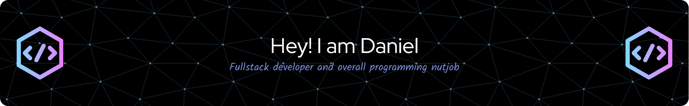

## About Me 🚀

I'm a passionate full stack developer with 20 years of experience in making all kinds of programs. I'm currently working as a freelancer and I'm open to new opportunities. I love to learn new things and I'm always looking for new challenges. I live in **Czechia** but as long as you don't mind me working remotely, I'm open to work for you from anywhere in the world.

- 🌱 I’m currently learning **Go**
- 👯 I’m looking to collaborate on **anything as long as it's fun**
- 📝 I write (rarely) articles on [my website](https://daniel.tlach.cz)
- 📫 How to reach me: [daniel@tlach.cz](mailto:daniel@tlach.cz) 
- ⚡ Fun fact: I love dogs and that's why I have four cats

## Contact Me 📞

Feel free to reach out to me for collaborations, mentorship or any general queries.

- Email: [daniel@tlach.cz](mailto:daniel@tlach.cz)
- LinkedIn: [Daniel Tlach](https://www.linkedin.com/in/danieltlach/)
